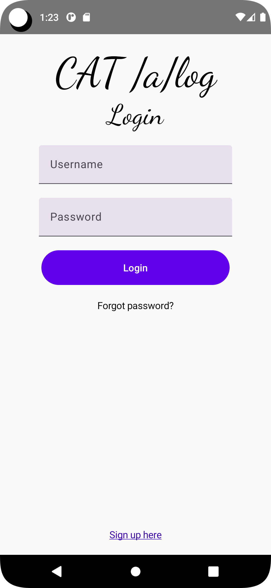

# Roteiro Prático

## Desenvolvimento Mobile com Kotlin e Android

[](https://www.cefetmg.br/)

Trabalho prático referente à disciplina do 6º período do curso de Engenharia de Computação, Laboratório de Engenharia de Software I (LES-I).

Alunos: Paulo Lopes do Nascimento, Samuel Augusto Oliveira Magalhães e Vinicius Hiago Gonçalves Ribeiro

Professor: Eduardo Cunha Campos

Este repositório contém um roteiro prático de aplicativo CRUD de um catálogo de livros simples no qual iremos discorrer sobre o desenvolvimento de um aplicativo mobile [Android] feito em [Kotlin].

O exemplo foi projetado para atender à demanda do Trabalho 1 da disciplina citada acima.
O objetivo é permitir que o usuário tenha um primeiro contato com desenvolvimento mobile com Kotlin e as tecnologias usadas na implementação das mesmas.

## Instalação
Este projeto requer [Kotlin].

Para instalar o Kotlin, devemos instalar uma das IDE's em que ele está incluído, que seriam nominalmente o [IntelliJ IDEA] ou o [Android Studio], como neste projeto queremos desenvolver um aplicativo Android, iremos baixar o Android Studio, para isso basta clicar neste [link](https://developer.android.com/studio) e seguir os passos.
## Desenvolvimento mobile
    
O desenvolvimento mobile passou por diversas fases desde seu advento inicial por meio dos Personal Digital Assistants (PDAs) *handhelds* e *palmtops* a partir da década de 90 até os anos 2010 e depois sua evolução aos *smartphones* e *tablets* que herdaram as funcionalidades dos PDAs e as expandiram absurdamente desde então.

Falaremos aqui especificamente de dois momentos do desenvolvimento mobile Android, antes e depois de 2018, ou mais especificamente antes e depois da criação do [Flutter]. Seguindo o sucesso do desenvolvimento Web e do padrão Model-View-Controller ter definido uma geração de *softwares* altamente utilizados nos anos 2000, o primeiro padrão utilizado para desenvolvimento Android era o Model-View-Controller, em seguida o Model-View-Presenter ou MVP e por fim, o mais recente Model-Viewl-ViewModel, o MVVM.

## MVC
No MVC, temos as seguintes camadas:
**Model** => Camada de dados, responsável por gerir a regra de negócio e dar suporte à conexões de rede e de banco de dados. Trabalha com fontes de dados remoto e local.
**View** => Camada de interface com o usuário, reponsável pela visualização dos dados do Model pelo usuário.
**Controller** => Camada lógica que integra as camadas Model e View. É responsável por captar os inputs e determinar o que fazer com ele.


Vantagens deste padrão:
- O MVC ajuda com o problema da separação das camadas. Aumenta a capacidade de testar o código e facilita sua escalabilidade.
- As classes de Modelo e Controle não fazem referência à classes de sistema do Android, facilitando o teste unitário.

Desvantagens deste padrão:
 - A View se acopla com certa força ao Model e ao Controller. O problema do acoplamento da View com o Model, é que como o Model fornece os dados, acaba que a View se torna parcialmente responsável pela sua manipulação, o que é papel do Controller.
 - Extender demais os Models pode aumentar os métodos exponencialmente pois serão necessários observadores para cada tipo de dados.
 - Quando a View tem muito acoplamento com o Controller e Model, mudanças na lógica podem requerer atualizações/mudanças em diversas classes, reduzindo a flexibilidade do padrão arquitetural.

O problema do MVC aplicado no Android, além das desvantagens citadas acima, era que a tecnologia das bibliotecas para o desenvolvimento mobile eram focadas em arquivos XML para Views, o que resultava em complicações para busca de itens na View, já que tínhamos que realizar consultas por IDs de campos, tal como consultas são feitas na DOM na Web.

### MVP
A primeira evolução do MVC aplicada no Android, foi o MVP. Neste padrão, existem três grandes atores: 
**Model** => Fornece os dados e contém a lógica de negócio do domínio do problema.
**View** => Responde à saída e entrada de dados, porém a saída para o usuário vem do Presenter, as entradas normalmente vem do usuário;
**Presenter** => Camada responsável por responder as invocações da camada View e invocações da camada Model, além de também poder invocar ambas as camadas. O Presenter trabalha a formatação e manipulação dos dados que entram em ambas as camadas paralelas e também pode incluir parte da lógica de negócio;


A principal diferença do MVP para o MVC, é a não existência de comunicação entre Model e View.
Este modelo era o predominante pré-2018, sendo a maioria dos aplicativos feitos sobre esta arquitetura, que na prática funcionava da seguinte maneira:
- Criava-se arquivos XML para descrição das telas, utilizando tags para layout (LinearLayout, ConstraintLayout, etc)
- Criava-se um arquivo contendo o modelo, que geralmente era uma classe Java simples.
- Criava-se arquivos Presenter para gerenciar as Views (via criação de um instrumento de comunicação chamado Contrato) e o Model.

Vantagens do MVP:
- Simples de implementar
- Desacopla as funções das camadas 
- Facilidade de realizar testes unitários devido ao alto acoplamento mencionado anteriormente.

Desvantagens:
 - Classe única Presenter tende a ficar bem grande.
 - Devido à criação única dos Contratos, o código pode crescer de forma extremamente rápida.

### MVVM
Por fim, uma das arquiteturas mais recentes, que é uma variação do MVP baseada em eventos.
Suas camadas são Model, View e ViewModel:
**Model** => Mesma função do MVP.
**View** => Camada responsável por apresentar os dados, estado do sistema e operações atuais na interface gráfica. Além disso, inicializa e instancia o ViewModel com elementos da View (informando sobre as ações do usuário).
**ViewModel** => Responsável por entregar dados do Model para a camada View e gerenciar as ações do usuário. Além disso, fornece os fluxos de dados (Flows e *streams*) para a View.


No MVVM, o ViewModel não mantém referência à View, diferente do Presenter no MVP. Fora isso, a relação Presenter-View é 1 para 1, já a View-ViewModel é 1 para muitos.
Por ser uma arquitetura baseada em eventos, pode ser aplicada de duas formas principais: Data Binding e RxJava, neste projeto usamos o Data Binding no Kotlin.

Vantagens:
 - Testes unitários são ainda mais simples, pois não há dependência forte sobre a View.
 - Como a View referencia o ViewModel mas não o contrário, e a relação é 1 para N, o acoplamento aqui é super baixo.
 - Possibilidade de variar as telas com diferentes ViewModels para uma mesma View.
 

Desvantagens
 - Alta complexidade para iniciantes.
 

## Sistema de exemplo
Nosso sistema é feito sobre a arquitetura MVVM, e foi construído usando o toolkit recomendado da Google para aplicações nativas: o Jetpack Compose, mais especificamente as bibliotecas [Room], [Material3] e [Hilt]:
 - Room => Biblioteca usada para interagir e gerar bancos de dados locais como um DAO, utilizando sqlite3 internamente.
 - Material => Biblioteca de suporte de criação de aplicativos, focada nos aspectos de design.
 - Hilt => Biblioteca de injeção de dependências para Android que reduz o código boilerplate criado por injeções manuais no projeto.

O Jetpack Compose foi criado para ser a ferramenta definitiva de desenvolvimento nativo pela Google, mas ainda encontra forte concorrência de frameworks como o Flutter e React Native, porém considerando o foco do roteiro, iremos trabalhar com o recomendado pela desenvolvedora e no que acreditamos ser o mais promissor.
Podemos separar os arquivos da seguinte maneira:
A camada de Modelo englobará os pacotes **Core**, que possui as constantes do projeto (não recomendado em projetos maiores, o ideal é usar o arquivo strings.xml),
**data** e **di**, que possui os arquivos de conexão e interface para o banco de dados e **domain** que possui o Model propriamente dito.
A camada View se encontra nos pacotes de **component**, tanto dentro do pacote **presentation/books** quanto no **presentation/update_book**, além dos arquivos com sufixo Screen e o MainActivity.
Por fim, a camada ViewModel que possui o arquivo **BooksViewModel**, neste caso temos apenas um ViewModel e duas telas, porém isso se deve ao fato de que a manipulação dos livros será a mesma em ambas.

A ideia é criar o repositório e o modelo, com um arquivo Dao com as queries que irão ser feitas no banco, um arquivo Database que retorna um objeto Dao e classes de acesso ao banco de dados, que seriam os arquivos Repository.

Depois, basta criar as telas com os métodos @Composable do Jetpack Compose, que são funções que te permitem definir a interface de usuário da sua aplicação de forma programável, descrevendo como ela deve parecer e fornecendo dependências de dados, ao invés de focar no processo de construção da interface gráfica, como era feita com os XMLs no MVC.
Arquivo ViewModel:
```
// Anotação identificando que é uma ViewModel para injeção dos construtores.
@HiltViewModel
// Definição da classe, filha de ViewModel() e injetando o construtor que recebe o repositório/interface dos dados.
class BooksViewModel @Inject constructor(
    private val repo: BookRepository
) : ViewModel() {
    // Definição da variável livro que recebe um estado baseado no objeto.
    var book by mutableStateOf(Book(0, NO_VALUE, NO_VALUE, NO_VALUE))
        private set
    // Definição do Dialog como falso inicialmente.
    var openDialog by mutableStateOf(false)
    
    // Definição da variável livros que recebe o retorno da consulta SELECT * do repositório de dados.
    val books = repo.getBooksFromRoom()
    // Definição do método getBook que recebe o retorno da consulta SELECT * FROM book WHERE id = :id do repositório de dados.
    // Usamos aqui uma corrotina viewModelScope, que torna o método assíncrono.
    fun getBook(id: Int) = viewModelScope.launch {
        book = repo.getBookFromRoom(id)
    }
    
     // Definição do método addBook que passa uma operação de Insert ao repositório de dados. Da mesma forma, o método é assíncrono.
    fun addBook(book: Book) = viewModelScope.launch {
        repo.addBookToRoom(book)
    }
    
    // Definição do método updateBook que passa uma operação de Update ao repositório de dados. Da mesma forma, o método é assíncrono.
    fun updateBook(book: Book) = viewModelScope.launch {
        repo.updateBookInRoom(book)
    }
    // Definição do método deleteBook que passa uma operação de Delete ao repositório de dados. Da mesma forma, o método é assíncrono.
    fun deleteBook(book: Book) = viewModelScope.launch {
        repo.deleteBookFromRoom(book)
    }
    // Método que atualiza o titúlo do livro atual.
    fun updateTitle(title: String) {
        book = book.copy(
            title = title
        )
    }
    // Método que atualiza o autor do livro atual.
    fun updateAuthor(author: String) {
        book = book.copy(
            author = author
        )
    }
    // Método que troca o estado do Dialog para abri-lo.
    fun openDialog() {
        openDialog = true
    }
    // Método que troca o estado do Dialog para fechá-lo.
    fun closeDialog() {
        openDialog = false
    }
}
```
Exemplo de tela de Login feita com Composables:



[//]: #

[Roteiro_KT]: <https://github.com/pauloVato-sketch/Roteiro_Kotlin>
[Android]: <https://www.android.com/intl/pt-BR_br/what-is-android/>
[Kotlin]:  <https://kotlinlang.org/docs/getting-started.html>
[IntelliJ IDEA]: <https://www.jetbrains.com/idea/download/>
[Android Studio]: <https://developer.android.com/studio>
[Room]: <https://developer.android.com/jetpack/androidx/releases/room>
[Material3]: <https://m3.material.io/develop/android/jetpack-compose>
[Hilt]: <https://developer.android.com/training/dependency-injection?hl=pt-br >
